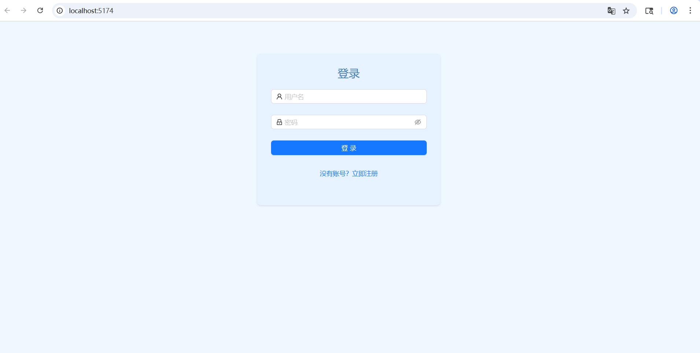
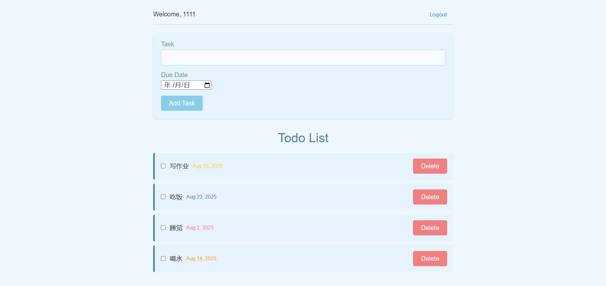

# 📝 全栈待办事项应用（Todo List）

一个美观且功能完整的全栈 Todo 应用，使用 **React + Vite** 作为前端，**Node.js + Express + MongoDB** 作为后端。支持用户注册、登录、添加、删除、标记完成任务，并带有截止日期提醒功能。

## 🚀 功能特性

- ✅ **用户认证**
  - 用户注册与登录
  - JWT 令牌鉴权
  - 登出自动清除信息
- ✅ **任务管理**
  - 添加、查看、编辑、删除任务
  - 标记任务完成状态
  - 设置截止日期并按紧急程度变色
- ✅ **响应式界面**
  - 使用 Ant Design 构建美观 UI
  - 适配桌面与移动端
- ✅ **错误处理**
  - 前后端异常捕获
  - 友好提示消息
- ✅ **完整 CRUD 接口**
  - RESTful 风格 API
  - 数据持久化存储

## 🖼 界面截图




---

## 🛠 技术栈

| 模块      | 技术                |
| --------- | ------------------- |
| 前端      | React, Vite, CSS    |
| UI 组件库 | Ant Design          |
| 后端      | Node.js, Express    |
| 数据库    | MongoDB             |
| 认证方式  | JWT                 |
| 工具      | Axios, dotenv, CORS |

---

## 📂 项目结构

```

TodoList/
├── backend/ # 后端服务
│ ├── controllers/ # 控制器逻辑
│ ├── routes/ # 路由定义
│ ├── middleware/ # 中间件（如 auth）
│ ├── models/ # 数据模型
│ └── app.js # 服务器入口
├── frontend/ # 前端应用
│ ├── src/
│ │ ├── components/ # 组件
│ │ ├── api.js # API 请求封装
│ │ ├── App.jsx # 主组件
│ │ └── main.jsx # 入口文件
│ └── index.html
└── README.md # 项目说明

```

## 🚦 快速启动

**1. 克隆项目**

git clone https://github.com/GIridium/Todo-List.git
cd todolist-fullstack

---

**2. 启动后端服务**

cd backend

_安装依赖_
npm install

_创建 .env 文件_
echo "PORT=5000
NODE_ENV=development
MONGODB_URI=mongodb://localhost:27017/tododb
JWT_SECRET=your_jwt_secret_key_here" > .env

_启动服务器_
node app.js

> 🌐 后端运行在 `http://localhost:5000`

**3. 启动前端开发服务器**

cd ../frontend

**安装依赖**

npm install

**启动开发模式**

npm run dev

> 🌐 前端运行在 `http://localhost:5173`

---

## 🔐 环境变量配置

### `backend/.env` 示例

```env
PORT=5000
NODE_ENV=development
MONGODB_URI=mongodb://localhost:27017/tododb
JWT_SECRET=supersecretjwtkey123
```

---

## 🧪 API 接口列表

| 方法   | 接口                 | 说明                 |
| ------ | -------------------- | -------------------- |
| POST   | `/api/auth/register` | 用户注册             |
| POST   | `/api/auth/login`    | 用户登录，获取 token |
| GET    | `/api/todos`         | 获取所有任务         |
| POST   | `/api/todos`         | 创建新任务           |
| PUT    | `/api/todos/:id`     | 更新任务             |
| DELETE | `/api/todos/:id`     | 删除任务             |

> 🔒 所有 `/todos` 开头的接口都需要登录（携带 JWT token）才能访问。

---

## 🧹 错误处理机制

- Token 失效或无效 → 自动登出并跳转登录页
- 网络错误 → 使用 Ant Design `message` 组件显示友好提示
- 数据异常 → 前端做防御性判断，避免页面崩溃

---

## 🎨 界面预览说明

| 页面        | 特点                         |
| ----------- | ---------------------------- |
| 登录/注册页 | 简洁表单设计，带实时验证提示 |
| 待办列表页  | 截止日期按颜色区分紧急程度   |
| 响应式适配  | 完美支持手机与桌面端浏览     |

### 紧急程度颜色说明

- 🔴 红色：任务已过期
- 🟠 橙色：今天到期
- 🟡 黄色：3 天内到期
- 🔵 蓝色：正常（3 天以上到期）
